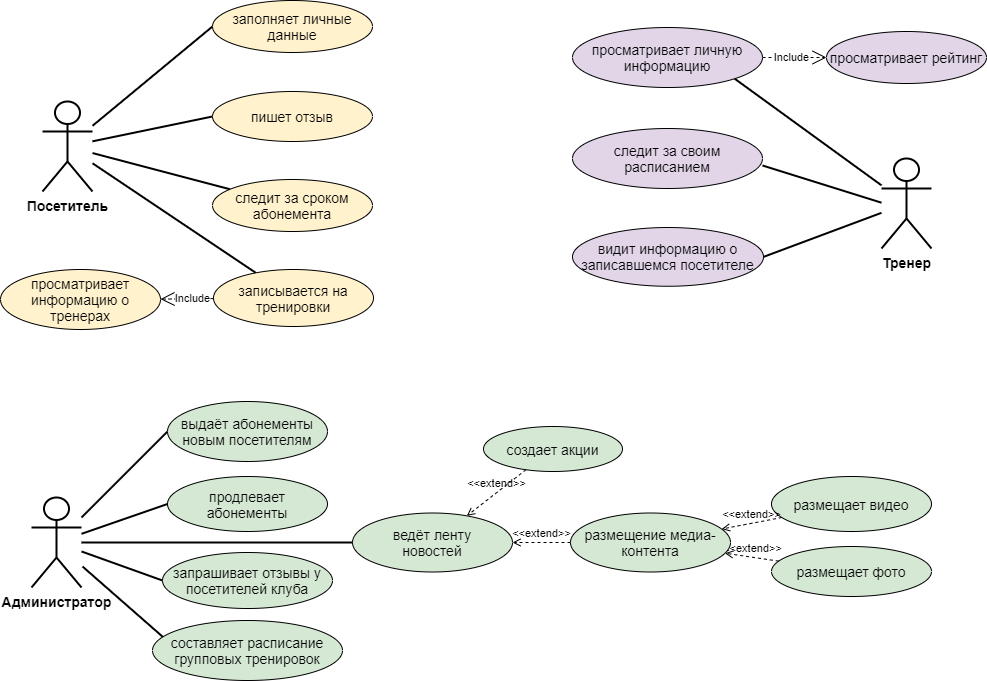
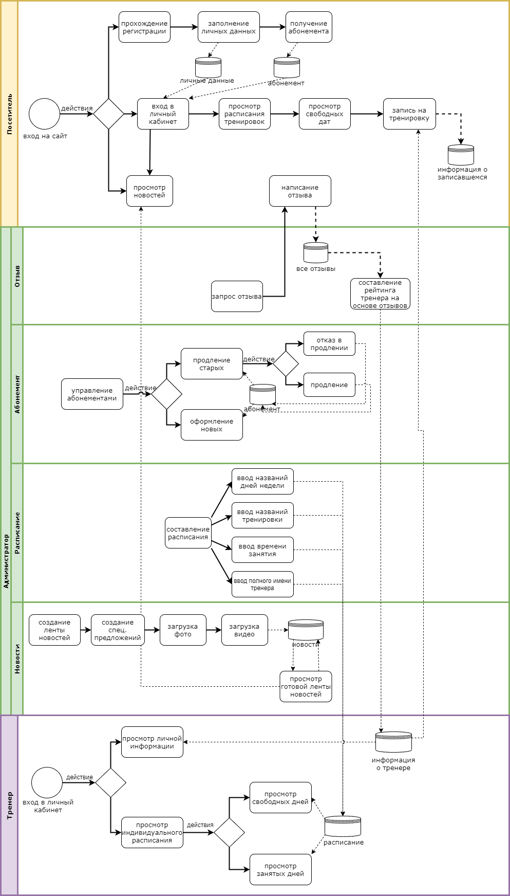
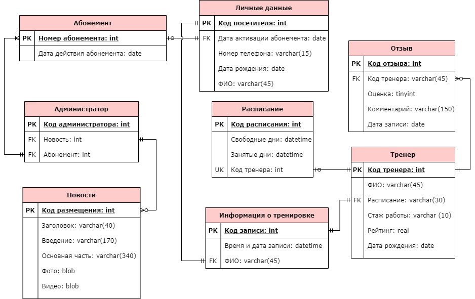
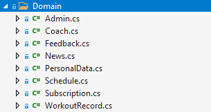

# Личный кабинет пользователя тренажерного зала

## Содержание


[Введение](#введение)

1. [Описание предметной области](#предметная_область)

1.1. [Проблематика](#проблематика)

1.2. [Цели и задачи](#цели_и_задачи)

1.3. [Варианты решения проблемы](#решение_проблемы)

2. [Сравнительный анализ существующих решений](#анализ)

3. [Разработка информационной системы](#разработка)

3.1. [Проектирование информационной системы](#проектирование)

3.2. [Реализация информационной системы](#реализация)

4. [Тестирование информационной системы](#тестирование)

[Заключение](#заключение)

[Список использованных источников](#ссылки)

***

## Введение <a name="введение"></a>

Темой проекта является информационная система "Личный кабинет пользователя тренажёрного зала", так как в последнее время наметилась тенденция к здоровому образу жизни и всё больше людей устремляют свой взор в сторону правильного питания и тренировок. Фитнес услуги, как никогда, сегодня пользузуются огромной популярностью. Именно поэтому идея создания данной информационной системы отличается актуальностью и позволяет построить успешный выгодный бизнес.

***

## 1 Описание предметной области <a name="предметная_область"></a>

Человек, заинтересованный в посещении тренажёрного зала, заходит на сайт и может просмотреть ленту новостей, зарегистрироваться, получить абонемент и войти в личный кабинет или, если у него уже есть учётная запись, сразу попасть в личный кабинет. Далее он может выбрать себе тренера, посмореть его расписание и записаться на занятие. После встречи посетитель может оценить его работу и оставить комментарий.

Администратор сайта занимается выдачей и продлением абонементов и составлением расписания, согласованного с тренерами. Кроме того, администратор ведёт ленту новостей, в которую добавляет всё, что связано с работой клуба, это могут быть какие-либо изменения в графике работы, фото, видео, скидки и спец.предложения. Помимо всего вышеупомянутого администратор составляет расписание, которое обязательно должно быть согласованно с каждым тренером заранее.

Что касается самого тренера, то он заходит в личный кабинет и может видеть ту же самую ленту новостей, своё расписание с занятыми и свободными днями и информацию о записавшемся.

***

## 1.1 Проблематика <a name="проблематика"></a>

Сторонники здорового образа жизни знают о пользе фитнеса, но не понимают, какой зал или программу занятий выбрать. Чтобы лучше в этом разобраться, потенциальные клиенты ищут информацию онлайн, сравнивают сайты различных фитнес центров. Поэтому создать качественную спортивную информационную систему важно для привлечения новых клиентов и удобства нынешних пользователей. Информационные системы нужны для поддержания доверия, упрощения взаимодействия между пользователем и клубом (например, через личный кабинет), предоставления информации об услугах, а также аккредитации спортивных тренеров.

Как уже говорилось выше, чтобы выбрать подходящий спортзал, пользователи сравнивают их социальные сети, сайты, и выбирают тот клуб, который предоставляет полезную информацию о компании, предлагает помощь онлайн.

***

## 1.2 Цели и задачи <a name="цели_и_задачи"></a>

Целью данного проекта является создание такой информационной системы спортивного клуба, который заинтересует любого человека, посетившего страницу.

Задачи проекта.
1. Информация, при всём её многообразии, должна подаваться просто и доступно. 
2. Нужно передать атмосферу клуба. 
3. Необходимо показать, что услуги предназначаются всем, кто в них заинтересован - для профессиональных спортсменов, для тех, кто может посещать занятия в обеденный перерыв, после работы, по выходным или рано утром.

***

## 1.3 Варианты решения проблемы <a name="решение_проблемы"></a>

Чтобы заинтересовать потенциального посетителя фитнес-центра, необходимо рассказать о всех услугах на странице клуба и проиллюстрировать их фотографиями. Чтобы побудить пользователя выбрать именно этот спортзал, недостаточно просто написать, какие тренажёры размещены в нём. Нужно разместить их изображения на странице, рассказать о применении различных типов оборудования.

Кроме того, следует разместить информацию о тренерах и их достижениях. Это поможет показать экспертность, завоевать доверие. Информация о фитнес тренере позволит клиенту поближе с ним познакомиться, а при интеграции с социальными сетями инструктора (например, Инстаграм) приведёт его подписчиков на сайт клуба.

Главным преимуществом данной информациооной системы может стать расписание тренировок с возможностью онлайн записи. Эта функция позволит клиенту сразу выбрать удобное время у понравившегося тренера, без необходимости оставлять заявку или звонить операторам.

Также пользователи оценят возможность оформить клубные карты онлайн, получить скидку по специальному промо-коду. А информативные, полезные статьи, а также видео для каждого сегмента целевой аудитории помогут выделиться среди других фитнес центров.

***

## 2 Сравнительный анализ существующих решений <a name="анализ"></a>

Продвижение фитнес бизнеса через Интернет на данный момент является одним из ключевых каналов по привлечению потенциальных клиентов. В наши дни у всех современных клубов уже давно есть сайт или мобильное приложение. Рассмотрим два уже существующих сайта потенциальных конкурентов "Yclients" (https://www.yclients.com/fitness) и "1С:Фитнес клуб" (https://1c.fitness/) и их особенности.

Исследование программы для управления фитнес-клубом "Yclients" показало, что 25% записей создаются в нерабочие часы компаний, поэтому, чтобы не упускать клиентов, была создана форма онлайн-записи на сайте, которая позволит клиентам записаться на тренировку самостоятельно в любое время. Кроме того, чтобы посетители не забывали про занятие, были созданы напоминания. Благодаря автоматическим уведомлениям клиенты не будут забывать о своих записях. А для удобсства записи расписание занятий находится на одном экране. Единый график проведения групповых и индивидуальных тренировок позволяет администратору быстро оценить наргузку и выбрать время для создания новой записи. Просматривать расписание можно в рамках дня или на неделю вперёд. Тренеры и администраторы могут управлять записями с компьютеры, телефона или планшета и сообщать клиентам об изменениях в занятии в несколько кликов.

В личном кабинете клиента фитнес-клуба "1С:Фитнес клуб" учтено всё необходимое для клиентов фитнес-клубов, он максимально удобный, информативный, лаконичный и надёжный. В Личном кабинете Клиента есть все необходимые функции и возможности для полного и быстрого управления своим членством и пакетами услуг. 1С:Фитнес клуб предлагает онлайн-оплату через банковский эквайринг, пополнение личного счёта, заморозку членства или пакета услуг, покупку персональных программ и дополнительных услуг фитнес-клуба. Кроме того, в 1С:Фитнес клубе есть онлайн-расписание с изменениями в режиме реального времени: 
* запись на групповые, персональные тренировки;
* удобный подбор занятий и тренеров с фильтрацией по времени, типу и группам;
* информативная карточка занятия: данные о тренере, описание занятия, онлайн-бронирование, свободные места.

Также присутствует возможность просмотреть всю информацию как о забронированных занятиях, так и прошедших: можно отменить предстоящее занятие или просмореть историю прошедших.

***

## 3 Разработка информационной системы<a name="разработка"></a>

введение

***

## 3.1 Проектирование информационной системы <a name="проектирование"></a> 

Разработка информационной системы начинается с создания USE-CASE диаграммы, отображающей действующие лица данной системы: Адмиристратор, Тренер, Посетитель.



Далее на основе USE-CASE диаграммы создаётся BPMN (Business Process Management Notation - Нотация моделирования бизнес-процессов) диаграмма, которая представляет собой описание графических элементов, используемых для построения схемы протекания рабочего процесса. Как минимум, такая схема нуна, чтобы выстроить в соответствии с ней бизнес-процесс и понятно регламентировать его для всех участников.



Завершающей диаграммой является ER-диаграмма, в которой показано, как разные "сущности" (люди, объекты и т.д.) связаны между собой внутри системы.



## 3.2 Реализация информационной системы <a name="реализация"></a>

На основе ER-диаграммы создаём класс с указанием полей, параметров и типов данных для каждой сущности. Приведём пример создания класса для сущности Admin.

```s C#
namespace pyrikova.Domain
{

    public class Admin
    {

        public int AdminId { get; set; }

        public int New { get; set; }

        public int Subscription { get; set; }
    }
}
C# s```

Создаём классы для других сущностей:



Далее для каждой сущности создаём контроллеры с методами Create, Read, Update, Delite. Приведём пример создания контроллера для сущности Admin:

using pyrikova.Domain;
using pyrikova.Repository;
using Microsoft.AspNetCore.Mvc;

namespace pyrikova.Controllers
{
    [ApiController]
    [Route("/admin")]
    public class AdminController : ControllerBase
    {
        [HttpPut]
        public Admin Create(Admin admin)
        {
            Storage.AdminStorage.Create(admin);
            return admin;
        }

        [HttpGet]
        public Admin Read(int adminId)
        {
            return Storage.AdminStorage.Read(adminId);
        }

        [HttpPost]
        public string Update(string str)
        {
            return str;
        }

        [HttpDelete]
        public string Delete(string str)
        {
            return str;
        }

        [HttpGet("get-shedule")]
        public string Scheduling(string str)
        {
            return str; // Метод составления расписания
        }

        [HttpGet("request-feedback")]
        public string RequestForFeedback(string str)
        {
            return str; // Метод запроса отзыва
        }

        [HttpPost("create-news")]
        public string CreateNews(string str)
        {
            return str; // Метод создания ленты новостей
        }
    }
}

Создаём контроллеры для других сущностей:


## 4 Тестирование информационной системы <a name="тестирование"></a>

***

## Заключение <a name="заключение"></a>

если всё работать будет, то и итог будет...

***

## Список использованных источников <a name="ссылки"></a>

При разработке информационной системы были использованы следующие электронные ресурсы:
1. Draw.io [Электронный ресурс]. – Режим доступа: https://app.diagrams.net/. – Дата доступа: 02.09.2021.
2. PlantUML [Электронный ресурс]. – Режим доступа: https://plantuml.com/ru/. – Дата доступа: 02.09.2021.
3. Википедия [Электронный ресурс]. – Режим доступа: https://en.wikipedia.org/wiki/Create,_read,_update_and_delete. – Дата доступа: 23.09.2021.
4. METANIT.COM [Электронный ресурс]. – Режим доступа: https://metanit.com/sharp/tutorial/3.1.php. – Дата доступа: 06.11.2021.
5. METANIT.COM [Электронный ресурс]. – Режим доступа: https://metanit.com/sharp/tutorial/3.4.php. – Дата доступа: 06.11.2021.
6. JournalDev [Электронный ресурс]. – Режим доступа: https://www.journaldev.com/16774/sql-data-types. – Дата доступа: 11.11.2021.

***
 
